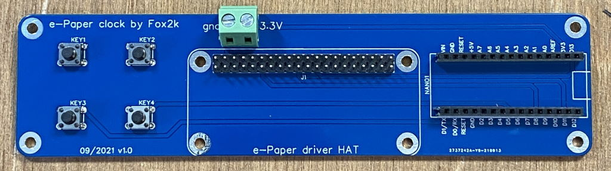

# 1. PaperClock

Paper Clock is a project about a clock printed in 3d which use an e-ink paper display to print time, temperature and humidity.
Designed to be low energy as much as possible. It can be placed on a table or on a wall.

- [1. PaperClock](#1-paperclock)
- [2. Hardware requirements](#2-hardware-requirements)
- [3. Software requirement](#3-software-requirement)
- [4. Installation for test and developpement](#4-installation-for-test-and-developpement)
- [5. How to set up the clock](#5-how-to-set-up-the-clock)
- [6. Installation for final version](#6-installation-for-final-version)
  - [6.1. Setting up the arduino](#61-setting-up-the-arduino)
  - [6.2. Creating the PCB](#62-creating-the-pcb)
  - [6.3. Creating the frame](#63-creating-the-frame)
- [7. Ressources](#7-ressources)

# 2. Hardware requirements

*Project was designed to work with this hardware. You may make it work with equivalent but pay attention to voltage and dimension, especially for 3D printed frame !*

**For test and developpement :**
  - [1 Waveshare 7.5inch E-Ink Display Hat for Raspberry Pi 880×528](https://www.amazon.fr/gp/product/B08QCJFJK5)
  - [1 Arduino BLE sense 3.3V](https://store.arduino.cc/products/arduino-nano-33-ble-sense)
  - 1 breadboard with straps (to try and dev) 

**To build the final version, add theses :**
  - [1 18650 battery coupler with 3.3V output](https://www.amazon.fr/gp/product/B086W7326Q) or equivalent
  - 1 18650 battery
  - [the PaperClock PCB](https://oshwlab.com/Fox2k/e-paper-clock)
  - [the 2 pieces frame to 3D print](https://cults3d.com/fr/mod%C3%A8le-3d/maison/cadre-pour-l-horloge-paperclock)
  - 12 [M3x3mm brass knurled threaded round inserts](https://www.amazon.co.uk/s?k=M3x3mm+brass+knurled+threaded+round+inserts)
  - 12 M3x6mm screws

# 3. Software requirement

- [Arduino IDE v1.8+](https://www.arduino.cc/en/software)
    - Add this package from boards manager : Arduino Mbed OS Nano Boards
    - Add this package from library manager : Arduino_HTS221 (for temperature and humidity sensors of the Nano 33 BLE Sense)

# 4. Installation for test and developpement

For test and developpement purposes, you do not need the battery. You can power the arduino nano BLE sense by USB

1. Wire the ePaper screen as explained in the [WaveShare E-Ink display doc](https://www.waveshare.com/wiki/7.5inch_HD_e-Paper_HAT_(B)) at section "User guides of Arduino". Except that you can power the E-ink display with 3.3V from the Arduino pin.
2. In addition, wire two buttons. One from GND to D4. One from GND to D5.

| e-Paper | Arduino | Buttons |
| :-----: | :-----: | :-----: |
|   Vcc   |  3.3V   |         |
|   GND   |   GND   |         |
|   DIN   |   D11   |         |
|   CLK   |   D13   |         |
|   CS    |   D10   |         |
|   DC    |   D9    |         |
|   RST   |   D8    |         |
|  BUSY   |   D7    |         |
|         |   D4    |  Hours  |
|         |   D5    | Minutes |

3. Once all is wired. Power the Ardunio via USB.

# 5. How to set up the clock

- Once powered up, the E-Ink should flicker during more or less 20 seconds then display the clock at 00:00, 
the temperature and the humidity.
- **Only when display is not flickering**, you can set up the clock by pressing Hours button as many as you want to increment hours, do the same actions with minutes button. Note that display will not change immediatly so you have to count in your head! (this is a e-ink display! not a 60fps monitor ;) )
- Note that you can check if arduino take your buttons press in account by looking at the arduino buit-in led. It will light on each time you press the buttons, if not, the arduino may be not powered or busy to refresh display.
- Unless ou changed it in code, the clock will refresh display every 5 minutes, to spare battery and display life

# 6. Installation for final version

## 6.1. Setting up the arduino

1. First, you can upload the program as explained in chapter "Installation for developpement". 

2. In real use mode, the arduino is directly powered from battery (the 3.3v output from the coupler) to it's 3.3v pin. So you have to cut the link between the 3.3v pads on the arduino board. Doing this will bypass the DC-DC regulator, use less power and make less self heating to have better temperature precision.

Note that when you cut the link between the two 3.3V pads, you isolate the DC/DC 5V->3.3 V circuit **and the board can't be programmed using the USB standard procedure**. To recover this functionality you need to restore the connection between the two pads with a drop of solder. 

## 6.2. Creating the PCB

This PCB is designed to mimic the Raspbery pi 40 pins GPIO so that you can just plug the waveshare e-Paper Driver HAT on it. It manage all wiring needed between the arduino board, the ePaper display and 4 buttons (currently 2 buttons are unused for future purposes).

You can find the schematics and the PCB in [the open Source Hardware Lab](https://oshwlab.com/Fox2k/e-paper-clock). Click the link "open in editor" below the PCB picture, then generate the gerber file by clicking in the menu "Fabrication" > "PCB Fabrication File (Gerber). you can order it at JLCPCB or just download the file to make it elsewhere.

## 6.3. Creating the frame

The frame STL files are freely available on [cults3D platform](https://cults3d.com/fr/mod%C3%A8le-3d/maison/cadre-pour-l-horloge-paperclock). There is two pieces :
* The frame to hold the ePaper display and to make your clock beautiful
* The support to hold the PCB, the battery and the display from the back

Theses pieces are tied together with M3x6mm screws. Once your pieces are printed, you have to put [M3x3mm brass knurled threaded round inserts](https://www.amazon.co.uk/s?k=M3x3mm+brass+knurled+threaded+round+inserts) with the help of a soldering iron. (Pay attention not to melt your PLA printed frame !! 200°C is far enough to put them on)

# 7. Ressources

- [Getting started with the Arduino Nano 33 BLE Sense](https://www.arduino.cc/en/Guide/NANO33BLESense)
- [WaveShare E-Ink Display documentation](https://www.waveshare.com/wiki/7.5inch_HD_e-Paper_HAT_(B))
